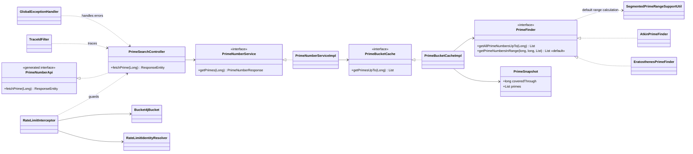

# Prime Number Service

A Java 21 and Spring Boot 4 REST service that returns every prime number up to
an inclusive upper limit. The application is API-first, supports JSON and XML,
uses selectable prime-finding strategies, extends cached results incrementally,
applies identity-aware token-bucket rate limiting, and propagates trace IDs
through responses and logs.

## Features

- `GET /primes/{number}` returns all primes from `2` through `number`.
- OpenAPI Generator creates the controller interface and response models.
- Sieve of Eratosthenes is the default prime-finding strategy.
- Sieve of Atkin is included as an alternative implementation.
- A segmented sieve calculates only the missing range when a cached snapshot
  must grow.
- Caffeine stores one high-watermark prime snapshot per algorithm.
- Bucket4j applies token-bucket rate limits by authenticated principal, trusted
  client ID, or anonymous IP fallback.
- JSON and XML responses are supported.
- `X-Trace-Id` is validated or generated for every request and included in logs
  and error responses.
- Unit tests, integration tests, JaCoCo coverage, Actuator, and Docker are
  configured.
- Note: Target Files folder are not added Gitlab Repo added 

## Technology

- Java 21
- Spring Boot 4.1
- Maven Wrapper
- OpenAPI Generator 7.22
- Caffeine
- Bucket4j 8.18
- Jackson 3 XML support
- JUnit 5, Mockito, MockMvc, Surefire, and Failsafe
- JaCoCo 0.8.15

## API

### Find primes

```http
GET /primes/{number}
```

`number` is an inclusive upper limit. The OpenAPI contract accepts values from
`2` through `10,000,000`.

JSON request:

```bash
curl -i \
  -H "Accept: application/json" \
  "http://localhost:8080/primes/11"
```

JSON response:

```json
{
  "initial": 11,
  "primes": [2, 3, 5, 7, 11]
}
```

XML request:

```bash
curl -i \
  -H "Accept: application/xml" \
  "http://localhost:8080/primes/11"
```

XML response:

```xml
<PrimeNumberResponse>
  <initial>11</initial>
  <primes>2</primes>
  <primes>3</primes>
  <primes>5</primes>
  <primes>7</primes>
  <primes>11</primes>
</PrimeNumberResponse>
```

The OpenAPI source is
[`src/main/resources/api/primenumber-swagger.yaml`](src/main/resources/api/primenumber-swagger.yaml).
During the Maven build, generated API and model sources are written beneath
`target/generated-sources/openapi`. Update the YAML contract rather than editing
generated Java files.

### Response codes

| Status | Meaning |
| --- | --- |
| `200 OK` | Prime numbers were returned. |
| `400 Bad Request` | The path value cannot be converted to `Long`. |
| `406 Not Acceptable` | The requested media type is not JSON or XML. |
| `422 Unprocessable Content` | The value violates the generated minimum or maximum validation constraint. |
| `429 Too Many Requests` | The caller's token bucket is empty. |
| `500 Internal Server Error` | An unexpected failure occurred. |

An error response contains a timestamp, HTTP status, message, request path, and
trace ID:

```json
{
  "timestamp": "2026-07-27T13:23:51.190592800Z",
  "status": 429,
  "message": "Rate limit exceeded",
  "path": "/primes/11",
  "traceId": "9949bad1715d45fab523dd9259459227"
}
```

## Request headers

### Trace ID

Clients may send:

```http
X-Trace-Id: order-service-123
```

Accepted values contain 1 to 64 letters, digits, dots, underscores, or hyphens.
If the value is absent or invalid, the service generates a 32-character ID.
Every response includes `X-Trace-Id`.

### Rate-limit headers

Successful rate-limited responses include:

```text
X-RateLimit-Limit: 20
X-RateLimit-Remaining: 19
```

When the bucket is empty, the response also includes:

```text
Retry-After: 3600
```

The current identity lookup order is:

1. Authenticated servlet `Principal`.
2. Trusted client ID request attribute populated by authentication middleware.
3. Remote IP address for anonymous requests.

The rate-limit key also includes the stable `prime-search` operation scope, so
changing the requested number does not create a new token bucket.

## Configuration

The default configuration is in
[`src/main/resources/application.yaml`](src/main/resources/application.yaml):

```yaml
spring:
  application:
    name: primeNumber

prime:
  finder:
    algorithm: eratosthenes
    max-limit: 10000000
    primeFinderCacheConfig:
      bucket-size: 2000
      maximum-entries: 100
      expire-after-access-minutes: 30

  rate-limit:
    enabled: true
    capacity: 20
    refill-tokens: 10
    refill-period: 1m
    cache-maximum-entries: 100
    cache-expire-after-access: 1h
```

Common environment-variable overrides:

```text
PRIME_FINDER_ALGORITHM=eratosthenes
PRIME_FINDER_MAX_LIMIT=10000000
PRIME_RATE_LIMIT_ENABLED=true
PRIME_RATE_LIMIT_CAPACITY=20
PRIME_RATE_LIMIT_REFILL_TOKENS=10
PRIME_RATE_LIMIT_REFILL_PERIOD=1m
```

## Prime-finding strategies

### Eratosthenes

`EratosthenesPrimeFinder` is active when:

```yaml
prime:
  finder:
    algorithm: eratosthenes
```

It performs a full Sieve of Eratosthenes for the initial snapshot. Later cache
extensions inherit the common `PrimeFinder#getPrimeNumbersInRange` default
method, which uses `SegmentedPrimeRangeSupportUtil` to calculate only the
missing range with bounded temporary sieve memory.

### Atkin

`AtkinPrimeFinder` implements the Sieve of Atkin for full calculations and
inherits the same default range operation for incremental cache extensions.

### Strategy extension contract

`PrimeFinder#getAllPrimeNumbersUpTo` is the required strategy operation.
getPrimeNumbersInRange is a default method because its segmented-sieve workflow is common to every 
strategy. The default method delegates to SegmentedPrimeRangeSupportUtil and records calculation timing.
Configured request limits are validated at the cache/service boundary.

This keeps algorithm implementations focused on full prime generation. A
future library adapter normally implements only `getAllPrimeNumbersUpTo`; it
can override `getPrimeNumbersInRange` when the library provides a more
efficient native range operation.

The current Atkin condition reads the misspelled property
`prime.finder.algorithim`. Before enabling Atkin, change its annotation to:

```java
@ConditionalOnProperty(
        prefix = "prime.finder",
        name = "algorithm",
        havingValue = "atkin"
)
```

After that correction, select it with:

```yaml
prime:
  finder:
    algorithm: atkin
```

## Range-aware Caffeine cache

The Spring cache is named `primesCache`, and the active algorithm is the entry
key. Its value is an immutable `PrimeSnapshot`.

With a bucket size of `2,000`:

```text
Request 51
  -> calculate through 2,000
  -> cache PrimeSnapshot(coveredThrough=2000)
  -> return the cached prefix through 51

Request 1,000
  -> reuse the 2,000 snapshot
  -> return its prefix through 1,000

Request 4,500
  -> extend the cached range from 2,001 through 6,000
  -> replace the old snapshot with PrimeSnapshot(coveredThrough=6000)
  -> return its prefix through 4,500
```

Only the highest snapshot for an algorithm is retained under that algorithm's
key; lower cumulative snapshots are not duplicated.

Both the prime snapshot cache and rate-limit buckets are local to one JVM. In a
multi-replica deployment, requests routed to different containers do not share
cache state or token counts. Use a distributed Bucket4j backend and a shared
prime cache if cross-replica consistency is required.

## Scope for improvement: pagination

The current endpoint returns every prime through the requested limit in one
response. This is convenient for smaller limits, but a request through
`10,000,000` returns `664,579` primes. A future version should offer
cursor-based pagination to reduce response serialization time, network
transfer, client memory consumption, and timeout risk.

Suggested API:

```http
GET /primes?upTo=10000000&size=1000
GET /primes?upTo=10000000&size=1000&after=7919
```

Suggested response metadata:

```json
{
  "upTo": 10000000,
  "primes": [7927, 7933, 7937],
  "pageSize": 1000,
  "nextCursor": 17389,
  "hasNext": true
}
```

The cursor can identify the last prime returned. Because cached prime lists are
sorted, the next page can be located with binary search instead of scanning
from the beginning.

Pagination should be applied after retrieving or extending the existing
high-watermark `PrimeSnapshot`; individual pages should not be cached
separately. This avoids duplicate cache entries. Pagination reduces response
and client costs, but the first request still calculates the complete snapshot
through `upTo`. Incrementally calculating only enough buckets to fill each page
is a possible later optimization for substantially larger limits.

Recommended defaults are a page size of `1,000` and a configurable maximum of
`10,000`. The existing path endpoint can be retained for backward compatibility
while the paginated endpoint is introduced.

## Architecture



## Build and run

Prerequisite: JDK 21.

Linux or macOS:

```bash
./mvnw clean package
./mvnw spring-boot:run
```

Windows:

```powershell
.\mvnw.cmd clean package
.\mvnw.cmd spring-boot:run
```

The application listens on `http://localhost:8080`. Actuator health is exposed
at:

```text
http://localhost:8080/actuator/health
```

## Tests and coverage

Run unit tests:

```bash
./mvnw test
```

Run unit tests, integration tests, and generate JaCoCo reports:

```bash
./mvnw clean verify
```

On Windows, replace `./mvnw` with `.\mvnw.cmd`.

JaCoCo outputs:

```text
target/site/jacoco/index.html
target/site/jacoco/jacoco.xml
target/site/jacoco/jacoco.csv
target/jacoco.exec
```

Integration-test classes end in `IT` and are run by Maven Failsafe.

## Docker

Build the image:

```bash
docker build -t prime-number-service:latest .
```

Run it:

```bash
docker run --rm \
  --name prime-number-service \
  -p 8080:8080 \
  -v prime-number-logs:/app/logs \
  prime-number-service:latest
```

Override runtime settings:

```bash
docker run --rm \
  -p 8080:8080 \
  -v prime-number-logs:/app/logs \
  -e PRIME_FINDER_ALGORITHM=eratosthenes \
  -e PRIME_FINDER_MAX_LIMIT=10000000 \
  -e PRIME_RATE_LIMIT_CAPACITY=20 \
  -e PRIME_RATE_LIMIT_REFILL_TOKENS=10 \
  -e PRIME_RATE_LIMIT_REFILL_PERIOD=1m \
  prime-number-service:latest
```

The image uses a Maven/Temurin 21 build stage and a Temurin 21 JRE runtime. The
application runs as the non-root `spring` user. `/app/logs` is writable and can
be mounted as a volume for rolling log persistence.

## Project structure

```text
.
|-- Dockerfile
|-- pom.xml
|-- src
|   |-- main
|   |   |-- java/com/org/prime
|   |   |   |-- annotations
|   |   |   |-- config
|   |   |   |-- controller
|   |   |   |-- exception
|   |   |   |-- filters
|   |   |   |-- helper
|   |   |   |   |-- cache
|   |   |   |   |-- interceptor
|   |   |   |   |-- primenumber
|   |   |   |   `-- ratelimit
|   |   |   |-- model
|   |   |   |-- service
|   |   |   `-- util
|   |   `-- resources
|   |       |-- api/primenumber-swagger.yaml
|   |       |-- application.yaml
|   |       `-- logback.xml
|   `-- test
|       |-- java/com/org/prime
|       `-- resources/application-it.yaml
`-- target/generated-sources/openapi
```

Application logs are written to the console and `logs/prime-api.log`. Logback
rolls files at 10 MB, retains up to 30 days, and enforces a 1 GB total cap.
